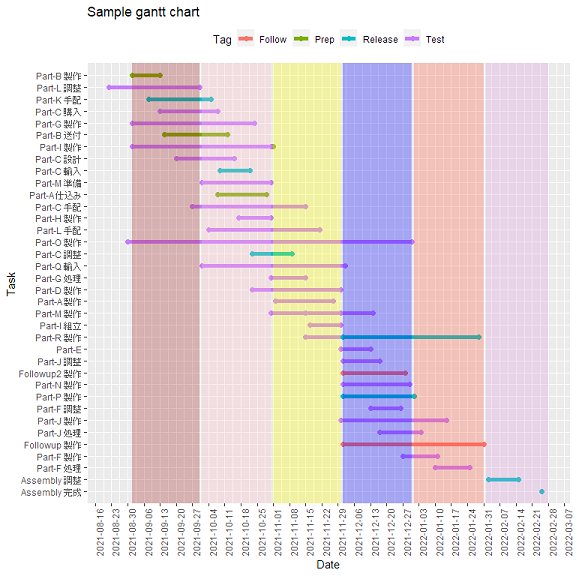

# notionganttchart

## Abstract

Redraw Gantt chart by R using Notion's Timeline which exported as Markdown & CSV.

## Usage

1. Create Notion's timeline.
1. Export it as Markdown & CSV.
1. Open notionganttchart.Rmd.
2. Edit it to suite to your needs, then run.

## Sample

Created from `.Rmd` file.

- [notionganttchart.md](notionganttchart.md)

