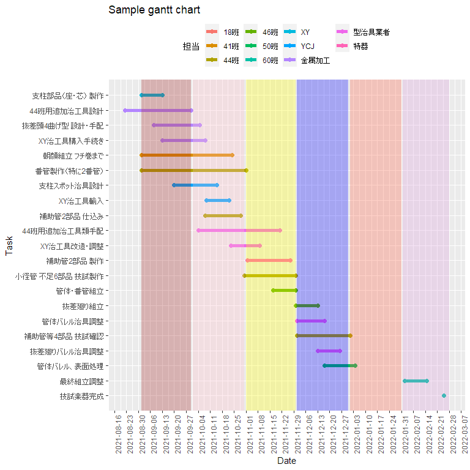
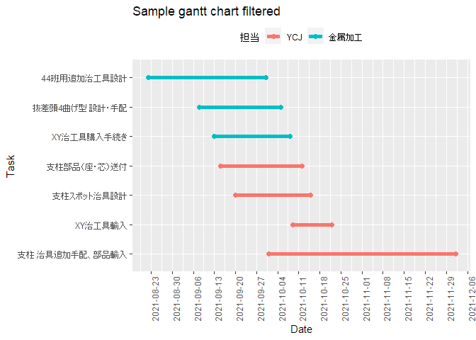
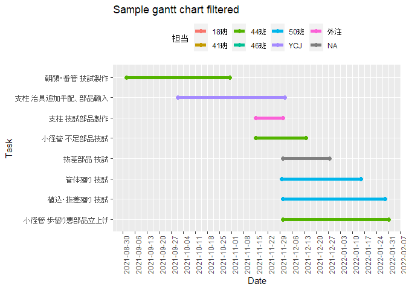

Sample Notebook to show gantt chart using Notion’s timeline CSV
================

-   [Read timeline CSV](#read-timeline-csv)
-   [Format timeline data](#format-timeline-data)
-   [Gantt chart](#gantt-chart)

## Read timeline CSV

``` r
library(tidyverse)
library(lubridate)
library(clock)
```

``` r
dat <- read_csv("notion.csv")
```

    ## Rows: 39 Columns: 5

    ## -- Column specification ---------------------------------------------------------------------
    ## Delimiter: ","
    ## chr (4): Name, Date, Tags, 担当
    ## lgl (1): Property

    ## 
    ## i<U+00A0>Use `spec()` to retrieve the full column specification for this data.
    ## i<U+00A0>Specify the column types or set `show_col_types = FALSE` to quiet this message.

## Format timeline data

Separate Date column into start, end.　Unicode rightarrow (0x2192) is
used to split. Fill End date if it is NA. Finaly stack it as Date again.
Drop unused column “Property”.

``` r
dat2 <- dat %>% 
    separate(Date,sep = "→", into = c("Start","End"), fill = "right") %>% 
    mutate(Start = mdy(Start),End = mdy(End)) %>% 
    mutate(End = if_else(is.na(End),Start,End)) %>% 
    select(-Property) %>% 
    pivot_longer(c(Start, End), names_to = "State", values_to = "Date") %>% 
    separate_rows(担当,sep = ",") %>% 
    mutate(担当 = str_remove(担当,regex("[:space:]")))
```

Just for info. In R, unicode character can be printed by specifying its
code.

``` r
"\u2192"
```

    ## [1] "→"

## Gantt chart

Filtering for plot.

``` r
dat3 <- dat2 %>% 
    filter(!is.na(担当) & Tags != "簡略表示") 
```

Count unique Names.

``` r
yn <- length(unique(dat3$Name)) + 1
```

``` r
dat3 %>% 
    ggplot(aes(x = Date, y = fct_reorder(Name,desc(Date)), color = 担当)) +
    geom_line(size = 2) + geom_point(size = 2) + 
    scale_x_date(breaks = "1 week") + 
    theme(legend.position = "top", axis.text.x = element_text(angle = 90)) +
    labs(title = "Sample gantt chart", y = "Task") + 
    # month color 
    annotate("rect", xmin = as.Date("2021-09-01"), xmax = as.Date("2021-09-30"), ymin = 0, ymax = yn, fill = "brown", alpha = 0.3) + 
    annotate("rect", xmin = as.Date("2021-10-01"), xmax = as.Date("2021-10-31"), ymin = 0, ymax = yn, fill = "pink", alpha = 0.3) +
    annotate("rect", xmin = as.Date("2021-11-01"), xmax = as.Date("2021-11-30"), ymin = 0, ymax = yn, fill = "yellow", alpha = 0.3) + 
    annotate("rect", xmin = as.Date("2021-12-01"), xmax = as.Date("2021-12-31"), ymin = 0, ymax = yn, fill = "blue", alpha = 0.3) +
    annotate("rect", xmin = as.Date("2022-01-01"), xmax = as.Date("2022-01-31"), ymin = 0, ymax = yn, fill = "tomato", alpha = 0.3) + 
    annotate("rect", xmin = as.Date("2022-02-01"), xmax = as.Date("2022-02-28"), ymin = 0, ymax = yn, fill = "plum", alpha = 0.3)
```

<!-- -->

Merit of using R to generate gantt chart is that it can enable to filter
some specific tasks.

``` r
dat2 %>% filter(担当 %in% c("YCJ","金属加工")) %>% 
    ggplot(aes(x = Date, y = fct_reorder(Name,desc(Date)), color = 担当)) +
    geom_line(size = 2) + geom_point(size = 2) + 
    scale_x_date(breaks = "1 week") + 
    theme(legend.position = "top", axis.text.x = element_text(angle = 90)) +
    labs(title = "Sample gantt chart filtered", y = "Task")
```

<!-- -->

Another filtering.

``` r
dat2 %>% filter(Tags == "簡略表示") %>% 
    ggplot(aes(x = Date, y = fct_reorder(Name,desc(Date)), color = 担当)) +
    geom_line(size = 2) + geom_point(size = 2) + 
    scale_x_date(breaks = "1 week") + 
    theme(legend.position = "top", axis.text.x = element_text(angle = 90)) +
    labs(title = "Sample gantt chart filtered", y = "Task")
```

<!-- -->
